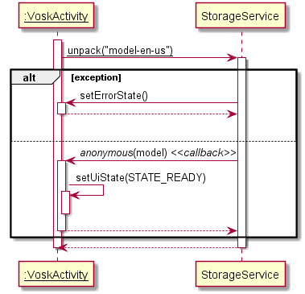
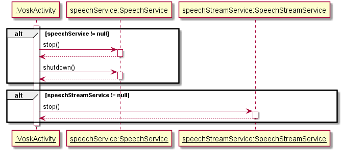
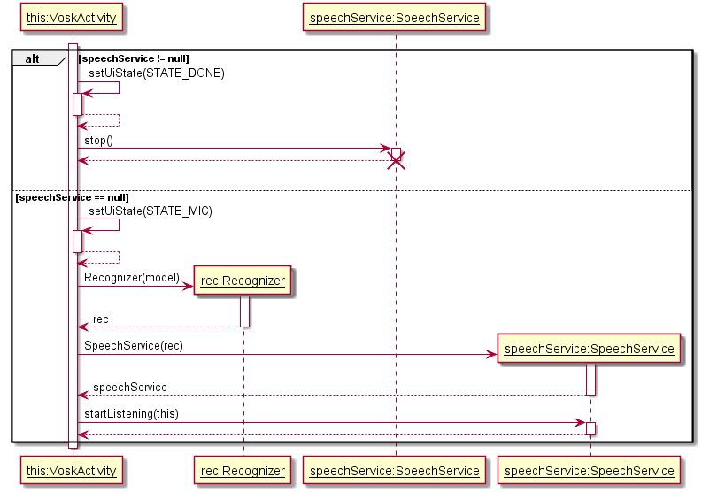

# Tescucho V2.0 - CISTAS

A continuación elaboramos una visión general tanto de la arquitectura de las aplicaciones para el sistema Andriod, como del diseño específico de la Tescucho, con el objetivo de guiar rápidamente a los desarrolladores que quieran colaborar con el proyecto.

## Arquitectura de las Aplicaciones para Android 

Si bien existieron en un principio alguna <a href="https://www.google.com/search?q=site%3Astackoverflow.com+android+MVC">indefinición acerca de la mejor nomenclatura</a>, hoy contamos con una descripción oficial del equipo de Android de la arquitectura que debieran seguir las aplicaciones para dicho sistema operativo, para la cual elaboraron el siguiente diagrama:

La manera en la que en general se entiende es la siguiente: una capa de nuestra aplicación expresará el diseño de nuestra interfaz con el usuario (archivos de _layout_ en XML, clases `Activity` y `Fragment`), otra capa corresponde al modelo de datos internos necesarios para cumplir con el procesamiento que nuestra aplicación realiza (clases propias), y en medio existirá una capa que comunique las acciones del usuario que tiene impacto en el modelo así como que le informe a la interfaz que el modelo posee un dato actualizado (clase `ViewModel`).

Parte de los recursos estáticos del proyecto incluye además del diseño en lenguaje de marcado XML, una colección de textos cuya centralización favorece la internacionalización (o traducción a otros idiomas), la identificación simbólica de colores que permite la creación de distintas paletas, y archivos de estilos y temas que sirven de manera jerárquica para la configuración de los atributos de cada elemento de la interfaz (como las "hojas de estilo" en HTML).

## El ciclo de vida de una Actividad

La organización de una aplicación en Android es por actividades, es decir, acciones o tareas únicas y específicas que se sirven también de una sola interfaz. La interacción de nuestra aplicación con el resto del sistema se ve así facilitada, ya que para algún recurso específico (un archivo, un contacto, una imagen) podemos ofrecer un tratamiento propio: mientras la aplicación de correo puede enviarlo a una dirección, nuestra aplicación podría editarlo, por ejemplo.

Las actividades tiene un ciclo de vida que relaciona el estado de la actividad con los recursos que el sistema le ha asignado en base a la interacción (o su ausencia) con el usuario. La documentación oficia del equipo de desarrollo de Android la ejemplifica con el siguiente diagrama de estados:

## La librería Vosk

La librería Vosk provee un [ejemplo de uso en una aplicación para el sistema Android](https://github.com/alphacep/vosk-android-demo), de donde hemos elaborado los diagramas de sequencia para reflejar la estructura dinámica que debiera seguir una actividad que la utilice.

### Creación de la actividad

Ignorando las configuraciones de la interfaz, el ejemplo propone para el método de creación de la actividad la interacción entre entidades representada en el siguiente diagrama de secuencia:

Como se observa, luego de la configuración de la interfaz en el estado de inicio con el método privado [`setUiState()`](https://github.com/alphacep/vosk-android-demo/blob/248f40de2449a6185a9e7b3fb9d985aa5221312c/app/src/main/java/org/vosk/demo/VoskActivity.java#L152), se activa la bitácora de seguimiento de la librería Vosk (mediante [`LibVosk`](https://github.com/alphacep/vosk-api/blob/master/android/lib/src/main/java/org/vosk/LibVosk.java)) y verifica que posea los permisos de acceso a la grabación de audio. Si no es así, los solicita. En caso de tener ya habilitada la grabación, inicia el modelo tal cual en el diagrama siguiente:

Lo anterior no es más que la deserialización del modelo (de clase [`Model`](https://github.com/alphacep/vosk-api/blob/master/android/lib/src/main/java/org/vosk/Model.java)) para la librería Vosk mediante el uso del [`StorageService`](https://github.com/alphacep/vosk-api/blob/master/android/lib/src/main/java/org/vosk/android/StorageService.java) que provee la librería, su almacenamiento en el atributo `model` y la configuración de la interfaz de usuario en caso de éxito, o el establecimiento de la interfaz en estado de error en caso de surgir algún inconveniente.

### Destrucción de la actividad

Como es habitual, antes de remover completamente la actividad del sistema, es necesaria una acción de limpieza que libere los recursos utilizados. Para ello, los desarrolladores del equipo de Vosk proponen en su ejemplo la siguiente secuencia:

Sucintamente, de lo que se trata es de detener los servicios registrados en caso de que ya hayan sido configurados con la asistencia de las clases [`SpeechService`](https://github.com/alphacep/vosk-api/blob/master/android/lib/src/main/java/org/vosk/android/SpeechService.java) y [`SpeechStreamService`](https://github.com/alphacep/vosk-api/blob/master/android/lib/src/main/java/org/vosk/android/SpeechStreamService.java) provistas por la librería.

### Registración de los servicios

Los servicios que la actividad precisa registrar para la captura de audio, se realizan mediante petición y asistencia de la interfaz de usuario, cuyos eventos son controlados por los métodos [`recognizeFile()`](https://github.com/alphacep/vosk-android-demo/blob/248f40de2449a6185a9e7b3fb9d985aa5221312c/app/src/main/java/org/vosk/demo/VoskActivity.java#L201) y [`recognizeMicrophone()`](https://github.com/alphacep/vosk-android-demo/blob/248f40de2449a6185a9e7b3fb9d985aa5221312c/app/src/main/java/org/vosk/demo/VoskActivity.java#L224). Siendo este último de nuestro interés, representamos su comportamiento dinámico mediante el siguiente diagrama de secuencia:

El resultado de los servicios es comunicado de manera asincrónica a la actividad, la que debe entonces implementar la interfaz [`RecognitionListener`](https://github.com/alphacep/vosk-api/blob/master/android/lib/src/main/java/org/vosk/android/RecognitionListener.java) definida en la librería, con los métodos [`onResult`](https://github.com/alphacep/vosk-android-demo/blob/248f40de2449a6185a9e7b3fb9d985aa5221312c/app/src/main/java/org/vosk/demo/VoskActivity.java#L124), [`onFinalResult`](https://github.com/alphacep/vosk-android-demo/blob/248f40de2449a6185a9e7b3fb9d985aa5221312c/app/src/main/java/org/vosk/demo/VoskActivity.java#L129), [`onPartialResult`](https://github.com/alphacep/vosk-android-demo/blob/248f40de2449a6185a9e7b3fb9d985aa5221312c/app/src/main/java/org/vosk/demo/VoskActivity.java#L138), [`onError`](https://github.com/alphacep/vosk-android-demo/blob/248f40de2449a6185a9e7b3fb9d985aa5221312c/app/src/main/java/org/vosk/demo/VoskActivity.java#L143) y [`onTimeout`](https://github.com/alphacep/vosk-android-demo/blob/248f40de2449a6185a9e7b3fb9d985aa5221312c/app/src/main/java/org/vosk/demo/VoskActivity.java#L148).

## Estructura estática de nuestra aplicación

### Descripción de archivos

Por motivos históricos y para distribuir un proyecto que fuera rápidamente compilables, el repositorio del código fuente de nuestra aplicación contiene directorios y archivos propios de la configuración del entorno de desarrollo. Obviaremos dichos archivos en la siguiente tabla descriptiva:

|Ruta|Descripción|
|---|---|
|.gradle\ |Carpeta con configuraciones propias de Gradle|
|.idea\ |Carpeta con configuraciones propias de Android Studio|
|COMPILING.md |Instrucciones de compilación|
|COPYING |Licencia|
|docs\ |Carpeta con página de la aplicación|
|Readme.md| Presentacion del repositorio |
|aars\ | Directorio con las librerías externas |
|aars\kaldi-android-5.2 | Directorio de la librería Kaldi |
|aars\kaldi-android-5.2.aar | Librería Kaldi |
|aars\kaldi-android-5.2\AndroidManifest.xml | Manifiesto de la librería |
|aars\kaldi-android-5.2\classes.jar | Clases de puente para java |
|aars\kaldi-android-5.2\R.txt | Descriptor de recursos |
|aars\kaldi-android-5.2\jni | Directorio con las implementaciones nativas de cada arquitectura |
|app\src\main | Directorio con código fuente de la aplicación |
|app\src\main\AndroidManifest.xml | Manifiesto de la aplicación |
|app\src\main\ic_oreja-playstore.png | Logo para la Playstore de Google |
|app\src\main\java | Directorio del código java |
|app\src\main\java\...\Clasico.java | Actividad del modo secuencial |
|app\src\main\java\...\Configuracion.java | Actividad de configuración |
|app\src\main\java\...\Inicio.java | Actividad de inicio |
|app\src\main\java\...\KaldiActivity.java | Actividad de modo continuo |
|app\src\main\res | Directorio de recursos de la aplicación |
|app\src\main\res\drawable | Directorio con imágenes y widgets |
|app\src\main\res\layout | Directorio con diseños de pantallas |
|app\src\main\res\layout\clasico.xml | Pantalla en modo secuencial |
|app\src\main\res\layout\inicio.xml | Pantalla de inicio |
|app\src\main\res\layout\main.xml | Pantalla en modo continuo |
|app\src\main\res\layout\settings_activity.xml | Pantalla de configuració |
|app\src\main\res\menu | Directorio con recursos de menú |
|app\src\main\res\values | Directorio con recursos referenciables |
|app\src\main\res\values\colors.xml | Listado de colores |
|app\src\main\res\values\strings.xml | Listado de textos estáticos |
|app\src\main\res\values\styles.xml | Hoja de atributos estáticos  de componentes |
|models\ | Carpeta con el modelo de lenguaje para la librería Kaldi |
